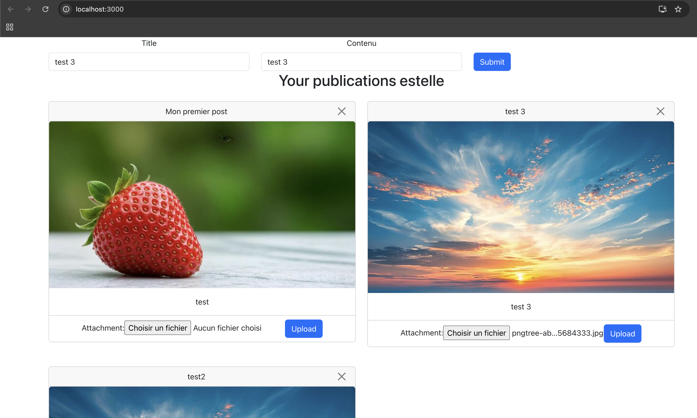

# Compte rendu – TP noté 2 Postagram

**Membres du groupe :**
- Rosine SORO
- Estelle Danielle FINGOUE


Ce document décrit le travail réalisé pour le devoir noté 2 (Postagram). Le sujet officiel est dans `readme.md`.

## Architecture cible

L’architecture ci-dessous rappelle le flux de l’application : l’utilisateur utilise l’application React dans le navigateur ; les requêtes API (GET/POST/DELETE /posts, GET signedUrlPut) passent par le Load Balancer vers les instances EC2 qui exécutent le webservice FastAPI. Le backend génère des URL présignées S3 pour que le client uploade les images directement dans le bucket S3. À chaque dépôt d’image dans S3, une Lambda est déclenchée, appelle Amazon Rekognition pour détecter les labels, puis met à jour la table DynamoDB. Le webservice lit et écrit les posts dans DynamoDB et renvoie les URLs présignées et les labels à l’IHM.


**Comment utiliser ce compte rendu :** ce document comporte deux parties. La **première** donne les commandes pour lancer et tester la solution en l’état (scénario où l’on souhaite directement faire tourner l’application et la tester). La **seconde** décrit étape par étape ce qui a été fait pour réaliser le TP et comment le reproduire (fichiers modifiés, valeurs, raison des choix).

---

## Lancer et tester la solution (état actuel)

Pour lancer l’application et la tester à partir du dépôt (AWS configuré, OpenTofu installé, Python 3 et Node/npm disponibles) :

**1. Déployer l’infrastructure**

```bash
cd "open tofu"
tofu init
tofu apply
```

À la fin de `tofu apply`, noter les valeurs des outputs `bucketname` et `dynamotablename`.

**2. Configurer le webservice**

Créer le fichier `webservice/.env` avec les deux variables (en utilisant les noms affichés en sortie de l’étape précédente) :

```
DYNAMO_TABLE=<dynamotablename>
BUCKET=<bucketname>
```

**3. Tester via l’application web**

La webapp est configurée pour appeler le Load Balancer. Lancer l’interface :

```bash
cd webapp
npm install
npm start
```

Ouvrir http://localhost:3000 dans le navigateur. L’API est appelée via l’ALB (URL déjà configurée dans `webapp/src/index.js`). Voici une capture de l’application lorsqu’elle fonctionne :



**4. Tester les endpoints (optionnel)**

Pour vérifier l’API directement, utiliser par exemple :

```bash
curl -s http://web-alb-823642335.us-east-1.elb.amazonaws.com/posts
```

D’autres exemples de commandes curl sont donnés dans la section « Étape 7/8 – Vérification et rendu » et dans le cheatsheet en fin de document.

**Test du backend en local ** : dans `webservice`, créer le venv (`python3 -m venv venv`), installer les dépendances (`venv/bin/pip install -r requirements.txt`), puis lancer `venv/bin/python app.py` et tester avec `curl http://localhost:8080/posts`, etc.

---

## Reproduction étape par étape

La section suivante détaille les modifications réalisées pour le TP et comment les reproduire, étape par étape.

---

## Étape 1 – OpenTofu : S3 et DynamoDB

**Objectif :** créer le bucket S3 et la table DynamoDB pour le stockage des images et des posts (sujet).

**Fichiers modifiés :** `open tofu/s3.tf`, `open tofu/dynamodb.tf`.

### open tofu/s3.tf

- **Bloc `resource "aws_s3_bucket" "bucket"`** (l.3–6)  
  Valeurs : `bucket_prefix = "postagram-"`, `force_destroy = true`.  
  Raison : bucket_prefix génère un nom unique (ex. postagram-xxx) et évite les conflits de noms globaux S3 ; force_destroy permet de vider et supprimer le bucket avec `tofu destroy` (utile en TP / dev).

- **Bloc `output "bucketname"`** (l.10–13)  
  Valeurs : `value = aws_s3_bucket.bucket.bucket`.  
  Raison : expose le nom du bucket pour user_data (webservice) et Lambda (variables d’environnement).

- **Bloc `resource "aws_s3_bucket_cors_configuration" "cors_bucket"`** (l.17–25)  
  Valeurs : `allowed_headers = ["*"]`, `allowed_methods = ["GET", "HEAD", "PUT"]`, `allowed_origins = ["*"]`.  
  Raison : CORS obligatoire pour que la webapp (navigateur) envoie des requêtes PUT vers S3 (upload direct depuis le front).

### open tofu/dynamodb.tf

- **Bloc `resource "aws_dynamodb_table" "basic-dynamodb-table"`** (l.3–20)  
  Valeurs : `name = "postagram-posts"`, `hash_key = "user"`, `range_key = "id"`, `billing_mode = "PROVISIONED"`, `read_capacity = 5`, `write_capacity = 5`, attributs `user` et `id` (type S).  
  Raison : sujet — partition par utilisateur (user), tri par id du post ; préfixes USER# / POST# utilisés dans le code Python.

- **Bloc `output "dynamotablename"`** (l.24–27)  
  Valeurs : `value = aws_dynamodb_table.basic-dynamodb-table.name`.  
  Raison : nom de la table pour .env (webservice) et Lambda (variable TABLE).

**Commandes exécutées :** `cd "open tofu"`, `tofu init`, `tofu apply`.

**Vérification :** `tofu apply` a réussi et les outputs `bucketname` et `dynamotablename` ont été affichés. Nous avons noté ces noms pour compléter le fichier .env à l’étape suivante.

---

## Étape 2 – Webservice : création et récupération de posts (local)

**Objectif :** implémenter POST /posts et GET /posts en local (sujet).

**Prérequis :** Étape 1 faite, noms du bucket et de la table connus.

**Fichiers modifiés :** `webservice/app.py`, création de `webservice/.env`.

### webservice/app.py

- **Import**  
  Modification : ajout.  
  Valeurs : `from boto3.dynamodb.conditions import Key`.  
  Raison : requêtes DynamoDB (query avec KeyConditionExpression).

- **Ordre chargement env**  
  Modification : `load_dotenv()` avant `from getSignedUrl import getSignedUrl`.  
  Raison : getSignedUrl utilise `os.getenv("BUCKET")` à l’import ; sans load_dotenv avant, BUCKET est None → erreur sur presigned URL.

- **POST /posts** (l.68–88)  
  Valeurs : user_key = USER# + authorization, post_id = POST# + uuid4(), item (user, id, title, body), `table.put_item(Item=item)`.  
  Raison : sujet — format user/id avec préfixes ; retour attendu par l’IHM.

- **GET /posts** (l.109–124)  
  Valeurs : paramètre optionnel `user` ; si présent `table.query(Key("user").eq("USER#" + user))`, sinon `table.scan()` ; formatage avec _post_to_response (URL présignée si image, label).  
  Raison : sujet — filtre par user ou liste globale ; format réponse avec image et label pour l’IHM.

- **Helper `_post_to_response`** (l.90–106)  
  Valeurs : génère URL présignée S3 et format (user, id, title, body, image, label).  
  Raison : éviter duplication et garder format IHM cohérent.

### webservice/.env (création)

- **Fichier :** `webservice/.env`  
  Valeurs : `DYNAMO_TABLE=<dynamotablename>`, `BUCKET=<bucketname>` (issus des outputs de l’étape 1).  
  Raison : ne pas committer ; nécessaire pour le webservice.

**Environnement :** création du venv dans `webservice` (`python3 -m venv venv` ou `python3.10 -m venv venv`), puis `pip install -r requirements.txt`. Lancer le webservice avec `venv/bin/python app.py` (ou `source venv/bin/activate` puis `python app.py`).

**Vérification :** Nous avons vérifié que POST /posts et GET /posts fonctionnent en local, avec le .env contenant DYNAMO_TABLE et BUCKET.

---

## Étape 3 – Lambda déclenchée par S3 + Rekognition

**Objectif :** à chaque dépôt d’objet dans le bucket, déclencher une Lambda qui appelle Rekognition et met à jour DynamoDB (sujet).

**Fichiers modifiés :** `open tofu/lambda.tf`, `open tofu/lambda/lambda_function.py`.

### open tofu/lambda.tf

- **Bloc `data "archive_file" "lambda_dir"`** (l.5–9)  
  Valeurs : source_dir = lambda, output_path = output/function.zip.  
  Raison : empaqueter le code Python pour la Lambda.

- **Bloc `resource "aws_lambda_function" "lambda_function"`** (l.12–35)  
  Valeurs : function_name = "postagram-rekognition", role = LabRole, handler = "lambda_function.lambda_handler", runtime = "python3.13", environment TABLE = nom table DynamoDB.  
  Raison : déclencher sur S3 ; variable TABLE pour que la Lambda connaisse la table.

- **Bloc `resource "aws_lambda_permission" "allow_from_S3"`** (l.39–46)  
  Valeurs : action Lambda Invoke, principal s3.amazonaws.com, source_arn = bucket.  
  Raison : autoriser S3 à appeler la Lambda.

- **Bloc `resource "aws_s3_bucket_notification" "bucket_notification"`** (l.50–57)  
  Valeurs : events = ["s3:ObjectCreated:*"], lambda_function_arn.  
  Raison : déclencher la Lambda à chaque dépôt d’objet dans le bucket.

### open tofu/lambda/lambda_function.py

- **Lecture event** (l.17–18)  
  Valeurs : bucket/key depuis event["Records"][0]["s3"], unquote_plus(key).  
  Raison : format event S3 ; unquote_plus pour les clés avec espaces.

- **Clés DynamoDB** (l.20–24)  
  Valeurs : user_key, post_id_key avec préfixes USER# / POST# si besoin.  
  Raison : aligner avec les clés stockées par le webservice.

- **Rekognition** (l.25–36)  
  Valeurs : detect_labels, MaxLabels=5, MinConfidence=0.75.  
  Raison : sujet — détection de labels sur l’image.

- **DynamoDB** (l.38–50)  
  Valeurs : update_item SET image = :img, label = :labels.  
  Raison : stocker le chemin S3 et la liste des labels dans l’item du post.

**Commandes exécutées :** `tofu apply` depuis `open tofu`. Nous avons testé en déposant un fichier dans le bucket (console AWS ou CLI) et en vérifiant que les labels apparaissent dans l’item DynamoDB.

**Vérification :** Nous avons constaté que la Lambda est invoquée à chaque upload et que les labels sont bien écrits en DynamoDB.

---

## Étape 4 – Webservice : DELETE /posts/{post_id}

**Objectif :** implémenter DELETE /posts/{post_id} avec suppression en DynamoDB et suppression de l’image dans S3 si présente (sujet).

**Fichiers modifiés :** `webservice/app.py`.

- **Route DELETE /posts/{post_id}** (l.127–147)  
  Modification : ajout de la route.  
  Valeurs : authorization → user_key (USER#), normalisation post_id (POST# si absent), get_item pour récupérer le post ; si champ image alors s3_client.delete_object ; puis table.delete_item ; si pas authorization → 401.  
  Raison : sujet — suppression du post en DynamoDB et de l’image dans S3 si présente.

**Vérification :** Nous avons vérifié que la suppression du post en base et de l’objet S3 (si une image était associée) fonctionne, et que l’API renvoie bien 401 en l’absence du header authorization.

---

## Étape 5 – OpenTofu : EC2, ASG, Load Balancer

**Objectif :** déployer le webservice sur une flotte EC2 (1 à 4 instances) derrière un ALB (sujet).

**Fichiers modifiés :** `open tofu/config_base.tf`, `open tofu/infra ec2.tf`, `open tofu/user_data.sh`.

### open tofu/config_base.tf

- **Bloc ingress** (l.52–58)  
  Valeurs : from_port 8080, to_port 8080, cidr_blocks 0.0.0.0/0.  
  Raison : webservice et health-check ALB sur port 8080 ; sans cela le Target Group reste unhealthy (502).

### open tofu/infra ec2.tf

- **Variables git_repo / iam_instance_profile_name** (l.4–13)  
  Valeurs : git_repo = URL du dépôt, iam_instance_profile_name = "LabInstanceProfile".  
  Raison : adapter le repo ; LabInstanceProfile pour AWS Academy.

- **Bloc aws_launch_template** (l.19–54)  
  Valeurs : AMI ami-0ecb62995f68bb549, t3.micro, key_name vockey, user_data avec templatefile(bucket, dynamo_table, git_repo).  
  Raison : sujet — instances avec user_data pour clone, .env et lancement app.

- **Bloc aws_autoscaling_group** (l.59–78)  
  Valeurs : desired 1, min 1, max 4, health_check_type ELB, target_group_arns.  
  Raison : sujet — 1 à 4 instances ; health-check via ALB sur 8080.

- **Blocs aws_lb, aws_lb_target_group** (l.83–117)  
  Valeurs : ALB application, TG port 8080, health_check path = "/posts".  
  Raison : webservice sur 8080 ; /posts évite 404 (pas de GET /).

- **Bloc aws_lb_listener** (l.122–132)  
  Valeurs : port 80, forward vers TG.  
  Raison : accès HTTP standard.

- **Output load_balancer_dns_name** (l.137–141)  
  Valeurs : value = aws_lb.web_alb.dns_name.  
  Raison : URL pour tests et baseURL webapp.

### open tofu/user_data.sh

- **Script** (l.6–14)  
  Valeurs : clone ${git_repo}, cd webservice, .env avec BUCKET et DYNAMO_TABLE, pip install, venv/bin/python app.py.  
  Raison : bootstrap des instances : même code et config que le sujet ; guillemets corrects pour .env.

**Commandes exécutées :** `tofu apply` depuis `open tofu` ; récupérer l’URL du Load Balancer (output `load_balancer_dns_name`).

**Vérification :** Les instances sont passées en état healthy derrière l’ALB ; nous avons vérifié que curl sur /posts retourne bien du JSON.

---

## Étape 6 – URL webapp

**Objectif :** configurer la webapp pour les tests sur AWS (sujet).

**Fichiers modifiés :** `webapp/src/index.js`.

- **Fichier :** `webapp/src/index.js` (l.12)  
  Modification : `axios.defaults.baseURL` vers l’URL du Load Balancer (sans slash final), ex. `"http://web-alb-823642335.us-east-1.elb.amazonaws.com"`.  
  Raison : pointer la webapp vers le Load Balancer pour les tests sur AWS.

**Commandes exécutées :** aucune (édition du fichier). Pour tester : `npm install` puis `npm start` dans `webapp`, et utiliser l’URL du Load Balancer.

**Vérification :** Nous avons configuré la baseURL de la webapp pour qu’elle pointe vers l’ALB.

---

## Étape 7/8 – Vérification et rendu

**Objectif :** vérifier tous les endpoints, upload d’images, affichage et labels ; finaliser le CR et préparer l’archive pour le rendu.

**Résumé des tests :** POST /posts, GET /posts (avec et sans filtre user), DELETE /posts/{post_id}, GET signedUrlPut puis upload S3, affichage des images et des labels Rekognition dans l’IHM.

**Commandes curl pour vérifier les endpoints**

URL du Load Balancer utilisée dans les exemples : `web-alb-823642335.us-east-1.elb.amazonaws.com`.

- **GET /posts** (tous les posts) — vérifier que l’API renvoie la liste des posts :
  ```bash
  curl -s http://web-alb-823642335.us-east-1.elb.amazonaws.com/posts
  ```

- **GET /posts?user=...** (posts d’un utilisateur) — vérifier le filtre par user :
  ```bash
  curl -s "http://web-alb-823642335.us-east-1.elb.amazonaws.com/posts?user=estelle"
  ```

- **POST /posts** (création d’un post) — vérifier la création :
  ```bash
  curl -X POST http://web-alb-823642335.us-east-1.elb.amazonaws.com/posts -H "Content-Type: application/json" -H "authorization: estelle" -d '{"title":"Titre","body":"Corps"}'
  ```

- **DELETE /posts/{post_id}** — vérifier la suppression (remplacer `<post_id>` par un id existant, ex. POST#uuid) :
  ```bash
  curl -X DELETE "http://web-alb-823642335.us-east-1.elb.amazonaws.com/posts/POST%23<uuid>" -H "authorization: estelle"
  ```

- **GET signedUrlPut** (URL présignée pour upload S3) — vérifier que le backend renvoie une URL :
  ```bash
  curl -s "http://web-alb-823642335.us-east-1.elb.amazonaws.com/signedUrlPut?filename=test.jpg&filetype=image/jpeg&postId=POST%23<uuid>" -H "authorization: estelle"
  ```

**Rappel rendu :** archive (ex. .zip) avec le code OpenTofu et le webservice, selon les consignes du sujet.

---

## Cheatsheet des commandes

Aide-mémoire : commande et rôle.

**OpenTofu (infra AWS)**

- `cd "open tofu"` — Se placer dans le dossier OpenTofu.
- `tofu init` — Initialiser le projet (télécharger providers, etc.).
- `tofu apply` — Créer ou mettre à jour les ressources AWS (S3, DynamoDB, Lambda, EC2, ALB, etc.).

**Webservice (Python / FastAPI)**

- `python3 -m venv venv` (ou `python3.10 -m venv venv`) — Créer l’environnement virtuel Python.
- `venv/bin/pip install -r requirements.txt` — Installer les dépendances du webservice.
- `venv/bin/python app.py` — Lancer le serveur FastAPI (port 8080).

**Webapp (React)**

- `npm install` — Installer les dépendances Node.
- `npm start` — Lancer l’application React en dev (ex. port 3000).

**Tests API (curl)**

- `curl -s http://web-alb-823642335.us-east-1.elb.amazonaws.com/posts` — Récupérer tous les posts.
- `curl -s "http://web-alb-823642335.us-east-1.elb.amazonaws.com/posts?user=..."` — Récupérer les posts d’un user.
- `curl -X POST http://web-alb-823642335.us-east-1.elb.amazonaws.com/posts -H "Content-Type: application/json" -H "authorization: ..." -d '{"title":"...","body":"..."}'` — Créer un post.
- `curl -X DELETE "http://web-alb-823642335.us-east-1.elb.amazonaws.com/posts/<post_id>" -H "authorization: ..."` — Supprimer un post.
- `curl -s "http://web-alb-823642335.us-east-1.elb.amazonaws.com/signedUrlPut?filename=...&filetype=...&postId=..." -H "authorization: ..."` — Obtenir une URL présignée pour upload S3.
